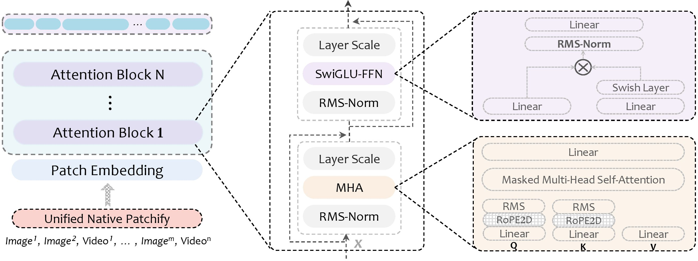

<h1 align="center">Unified Vision Transformer with Native Resolution</h1>

<h5 align="center">

[](https://arxiv.org/abs/2504.01792)&ensp;[]()&ensp;[](https://huggingface.co/collections/MM-MVR)&ensp;[](https://github.com/tatsu-lab/stanford_alpaca/blob/main/LICENSE)

</h5>

## 🌠 Introduction

We present **UniViTAR**, a family of homogeneous vision foundation models tailored for **unified visual modality and native resolution scenario** in the era of multimodal. We train our UniViTAR family across multiple model scales from **0.3B to 1B** exclusively on public accessible image-caption data, and observe a trend of performance increasing with parameter scaling. The overall pipeline of UniViTAR family as:

<p align="center"></p>

UniViTAR is a Transformer-based encoder model that inherits the original architecture of the conventional Vision Transformer but incorporates the following advanced modifications: *Unified Patchify for Native Image and Video Modality, 2D RoPE, SwiGLU, RMSNorm, and QK-Norm*. The detailed illustration of UniViTAR architecture as: 

<p align="center"></p>

## 📸 Release

* **`May. 21st, 2025`**: Our UniViTAR weights are uploaded on the HuggingFace website. The inference code of UniViTAR is available now! Enjoy [them](https://huggingface.co/collections/MM-MVR/univitar-682e9b2ad94221f13508e1ce) !
* **`Apr. 02nd, 2025`**: 🔥🔥🔥 We release **UniViTAR: Unified Vision Transformer with Native Resolution** on arxiv. Refer to [our paper](https://arxiv.org/abs/2504.01792) for more details !

## 🦙 Model Zoo

| Model | Size | \#Seen | IN1K<sup>ZS<sup> | IN1K<sup>LP<sup> | Flickr<sup>T2I<sup> | Flickr<sup>I2T<sup> | K400<sup>ZS<sup>  | ADE20K | 
|----------|-----|----|------|------|------|------|------|------|
| [UniViTAR-0.3B](https://huggingface.co/MM-MVR/UniViTAR-0.3B) | 310M | 14.6B  | 81.5  | 87.7 | 84.0 | 95.1 | 66.0 | 54.6 |
| [UniViTAR-0.6B](https://huggingface.co/MM-MVR/UniViTAR-0.6B) | 637M | 14.6B | 82.3  | 88.3 | 84.1 | 95.5 | 68.6 | 55.1 |
| [UniViTAR-1B](https://huggingface.co/MM-MVR/UniViTAR-1B) | 1419M | 14.6B  | 82.9  | 89.2 | 83.5 | 95.1 | 69.0 | 56.2 |
- <font size=1>*ZS: Zero-shot Classification, LP: Linear-Probe Classification, T2I/I2T: Zero-Shot Text-to-Image/Image-to-Text Retrieval*</font>
- <font size=1>Please see our [paper](https://arxiv.org/abs/2504.01792) for more results.</font>


## 🛠️ Environment   

1. Clone this repository and navigate to UniViTAR folder
   
   ```bash
   git clone https://github.com/MM-MVR/UniViTAR.git
   cd UniViTAR
   ```
2. Install Package
   
   ```Shell
   conda create -n univitar python=3.11 -y
   conda activate univitar
   pip3 install -r requirements.txt
   pip3 install flash-attn==2.6.3
   ```

## 🗝️ Quick Start

#### Example for UniViTAR family inference

```python
import torch
import numpy as np
from PIL import Image
from modeling_univitar import UniViTARVisionModel

# Prepare Model
model_name = "/path/to/UniViTAR-0.6B"
model = UniViTARVisionModel(f"{model_name}/config.json")
model.load_state_dict(torch.load(f"{model_name}/pytorch_model.bin", map_location="cpu"))
model = model.to(torch.bfloat16).cuda()

# Prepare Data: [(3, H1, W1), ..., (3, Hn, Wn)] --> (N1+...+Nn, P)
images = [Image.open(f"assets/demo1.jpg"), Image.open(f"assets/demo2.jpg")]
data_inputs, grid_shapes = [], []
for image in images:
    data_item = model.image_transform(image)
    input_data, grid_shape = model.data_patchify(data_item)
    data_inputs.append(input_data.to(torch.bfloat16).cuda())
    grid_shapes.append(grid_shape)
data_inputs = torch.concatenate(data_inputs, dim=0)

# Forward: (N1+...+Nn, P) --> [(N1, D), ..., (Nn, D)]
data_embeds = model(pixel_values=data_inputs, grid_shapes=grid_shapes)
data_embeds = data_embeds.split([np.prod(grid_shape) for grid_shape in grid_shapes])
print(data_embeds[0].shape, data_embeds[1].shape)
# torch.Size([16224, 1280]) torch.Size([4320, 1280])
```

## ✏️ Reference

If you find UniViTAR useful in your research or applications, please consider giving a star ⭐ and citing the following BibTeX:

```
@article{qiao2025univitar,
title={UniViTAR: Unified Vision Transformer with Native Resolution},
author={Qiao, Limeng and Gan, Yiyang and Wang, Bairui and Qin, Jie and Xu, Shuang and Yang, Siqi and Ma, Lin},
journal={arXiv preprint arXiv:2504.01792},
year={2025}
}
```
